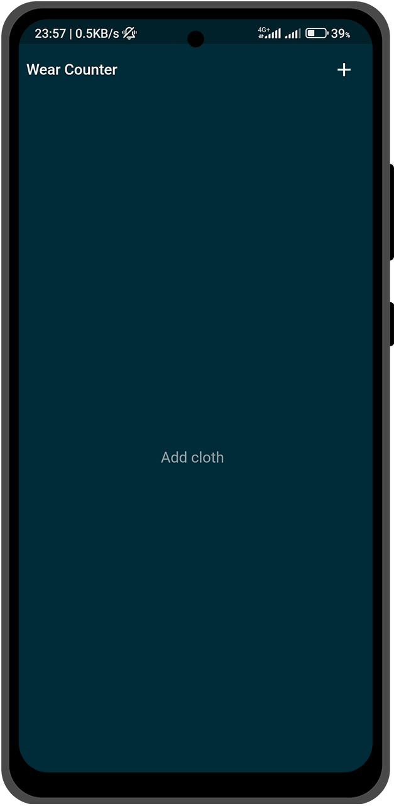
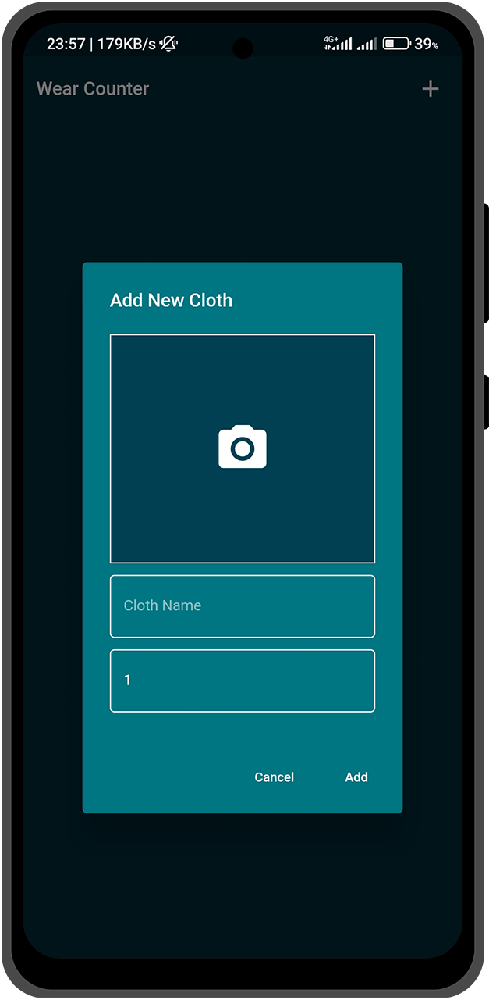
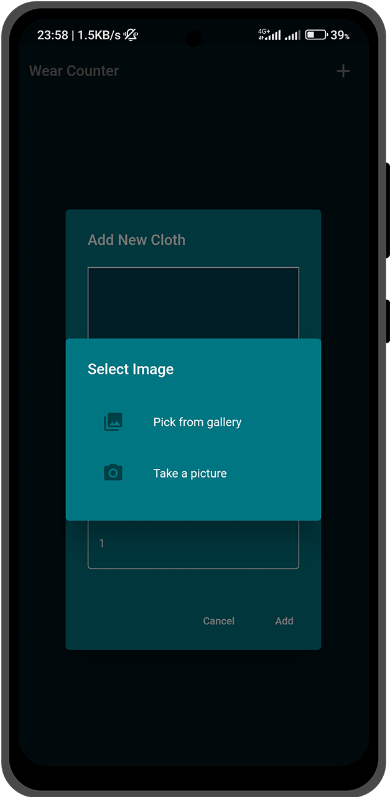
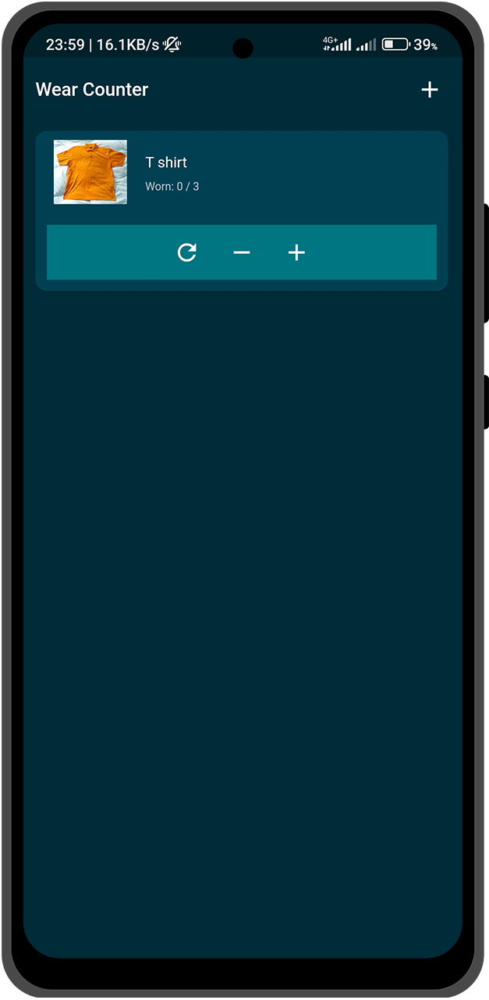
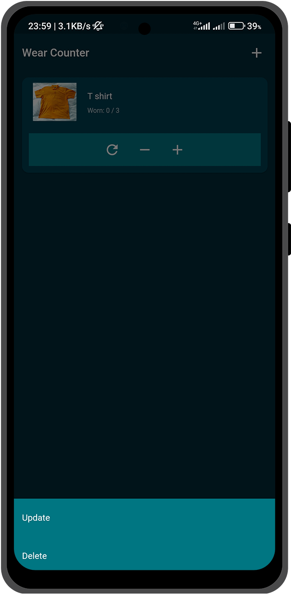

# 👕 Wear Counter

Wear Counter is a Flutter application designed to help users keep track of their cloth wear activity. The app allows users to add new clothes, increment wear counts, update cloth details, and delete clothes. This project was developed as a learning experience and has since been completed despite its limited practical application. <br>
_This is an abandoned project.._ 🤷

## 📜 Description

When people wear clothes multiple times without washing them, it's important to track how many times each item has been worn. Wear Counter aims to help users do just that. Users can add clothes with an image, name, and wear count. Each time a user wears a specific cloth, they can increment the wear count. The app also allows users to update cloth details and delete items as needed.

## ✨ Features

- **➕ Add Cloth**: Add a new cloth with an image, name, and wear count.
- **⬆️ Increment Wear Count**: Increment the wear count each time a cloth is worn.
- **⬇️ Decrement Wear Count**: Decrement the wear count if incremented by mistake.
- **🔄 Reset Count**: Reset the wear count to zero.
- **✏️ Update Cloth Details**: Update the details of existing clothes.
- **🗑️ Delete Cloth**: Delete a cloth from the list.
- **💾 Persistent Data**: All data is stored using SQLite for persistence.

## 🛠️ Installation

1. Clone the repository:
    ```bash
    git clone https://github.com/dinithmaleesha/wear-counter-flutter.git
    ```
2. Navigate to the project directory:
    ```bash
    cd wear_counter
    ```
3. Install the dependencies:
    ```bash
    flutter pub get
    ```

## 🚀 Usage

1. Connect a device or start an emulator.
2. Run the app:
    ```bash
    flutter run
    ```
3. Grant the necessary permissions (Storage and Camera) when prompted.

## 📸 Screenshots

<div style="white-space: nowrap;">
  
  
  
  
  
</div>


## 🤝 Contributing

Contributions are welcome! Please open an issue or submit a pull request.

Happy Coding!
